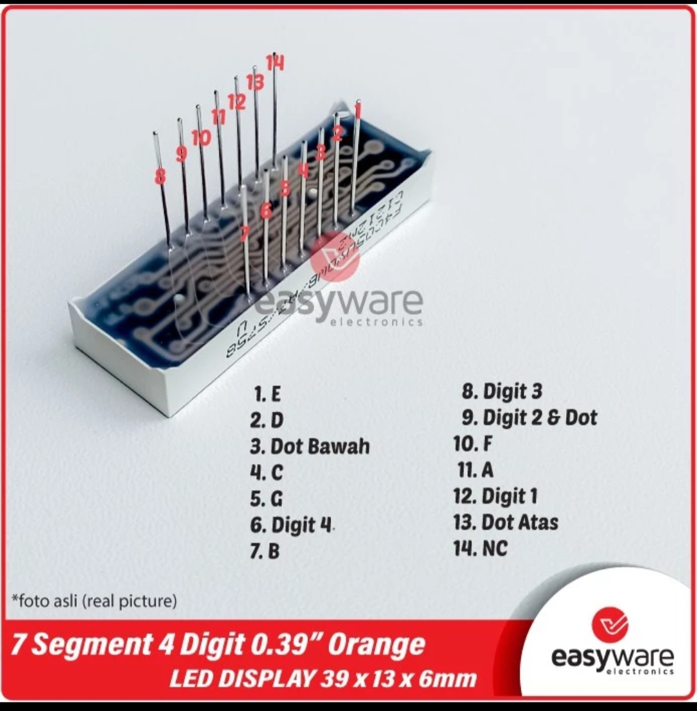

# Digital-Clock-and-Temperature-Monitoring
A system with time interrupt and using Arduino Uno, 7-segments as the display, and an LM35 sensor with two operation modes: a digital clock displaying time and a temperature monitor showing real-time temperature measurements.

The system consists of an Arduino Uno, 7-segment displays, LED, button, and LM35 sensor. The Arduino pin connections are specified in the source code. The 7-segment displays show the digital clock and temperature readings, while the LED indicates each passing second. The button switches between clock and temperature modes, and the LM35 sensor measures ambient temperature.

LED and button is also connected with 220 Ohms/1 kOhms resistor. 

The model of the 7-segments is F4CO5UYOwB/A7/S758, a common-cathode 7-segments with an orange colour. 7-segments has four digits and every digit is represented with PINX, where X is 1, 2, 3, or 4. Additionally, the digit is connected to the ground with a 220 Ohms/1 kOhms resistor. 7-segments has also Dot pins and each Dot pin is connected with resistors. Here's the pinout.
